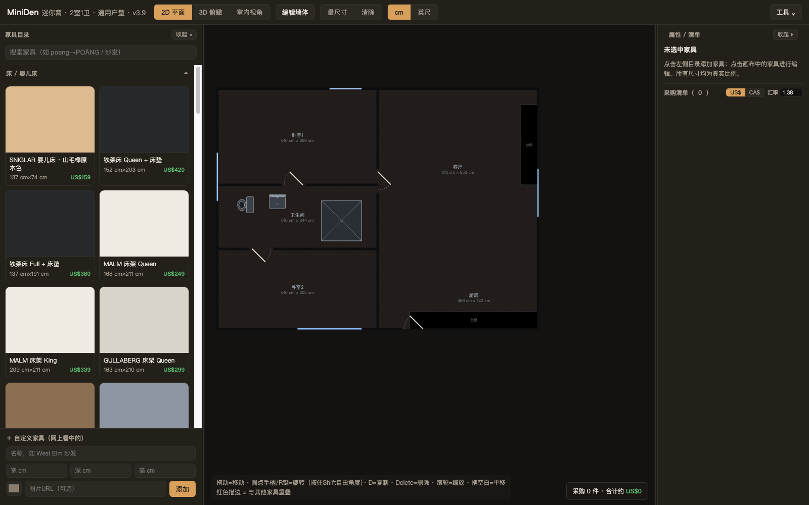
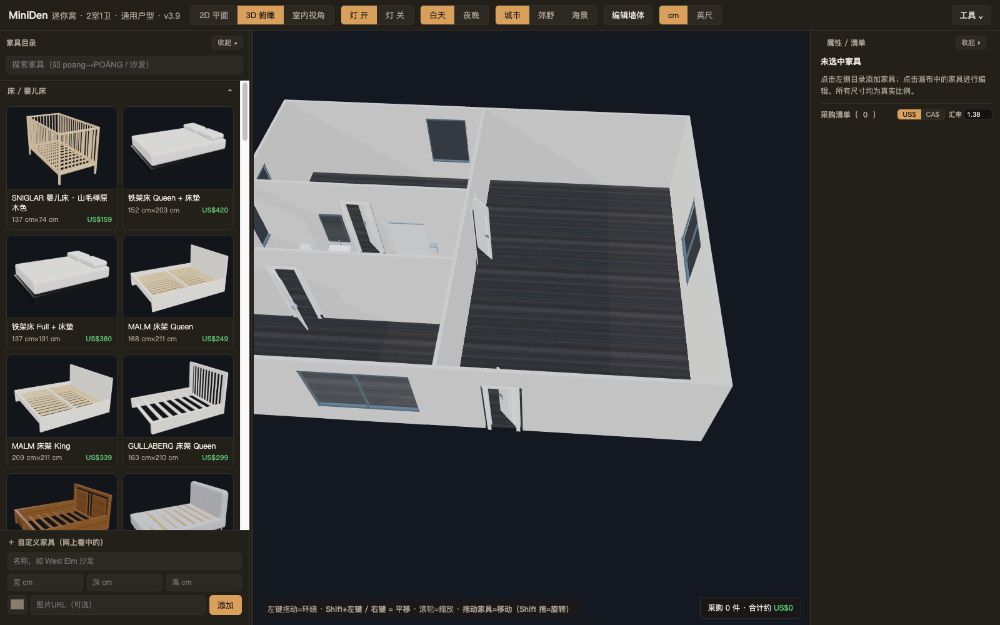

# MiniDen（迷你窝）

给一套高层公寓做家具规划的**单文件 Web 应用**。打开就能用：2D 平面图上拖放家具、
一键进 3D 娃娃屋 / 第一人称漫游、再一键出照片级渲染（浏览器里的软件路径追踪）。
不建模、不装软件——从「打开」到「形成我家的概念」以分钟计。





## 快速开始

没有构建步骤，没有网络依赖（`lib/` 全部本地化）：

```bash
git clone https://github.com/qining/miniden.git
open miniden/app.html          # macOS；或直接用 Chrome 打开 app.html
```

想要一个可托管 / 可分享的单文件产物：

```bash
cd miniden && npm install && npm run build
# → dist/app.html：three.js / dxf-parser / pdf.js 全部内联的独立单文件
```

## 它能做什么

- **2D 平面编辑器** — 拖放家具、画墙 / 异形柱 / 门（门洞与墙垛自动联动）、
  洁具放置工具、量尺寸工具、标准建筑图例
- **户型从哪来** — 三种：① 直接在编辑器里画；② 导入 **DXF**（图层名自动映射、
  单位自动检测、双线墙配对、一次确认）；③ 导入 **PDF 矢量图**（颜色语义、比例推断），
  扫描件可**描图**（底图 + 特征线辅助，沿底图描墙）
- **3D** — 娃娃屋俯瞰 + 室内第一人称（WASD 漫游）；275 件商品全部有专属 3D 模型
  （131 个模型函数，程序化木纹 / 织物 / 金属贴图，离线生成）
- **照片级渲染** — GPU 上的软件路径追踪：软阴影、间接光、À-Trous 降噪、
  分块自适应（弱显卡也能跑完）
- **采购清单** — 目录带美国 / 加拿大**当地实际标价**（不是汇率折算）、双币种切换、
  公寓自带灯具不计价
- **户型文档导出 / 导入** — 整份户型（几何 + 家具摆位）存成一个 JSON 文件，
  换浏览器 / 换机器都能带走
- **离线可用** — 运行时零 AI、零网络请求

## 快捷键

| 场景 | 键 |
|---|---|
| 选中家具 | `Delete` 删除 · `R` 转 15°（`Shift+R` 反向）· `[` `]` 微调 0.5°（`Shift` 0.1°）· `D` 复制 · 方向键移动（`Shift` 细步） |
| 墙体编辑 | 方向键微调 1cm（`Shift` 5cm）· `Enter` 完成画墙 / 多边形 · `Backspace` 撤一个顶点 / 删除选中 · `Esc` 取消 |
| 室内漫游 | `W` `A` `S` `D` / 方向键 |
| 量尺寸 | 再点按钮或 `Esc` 退出 |

URL hash 直达：`#3d`（娃娃屋）。

## 仓库结构

| 路径 | 是什么 |
|---|---|
| `app.html` | **唯一事实来源**（约 1 万行单文件应用，含 275 条家具目录） |
| `dist/app.html` | 构建产物：单文件公开入口（`npm run build` 生成） |
| `lib/` | vendored 运行时库（three.js r147 / OrbitControls / dxf-parser / pdf.js），署名见 [THIRD-PARTY.md](THIRD-PARTY.md) |
| `data/plans/generic.json` | 通用户型（2室1卫，无个人数据），内嵌进 `app.html` 的 `#miniden-plan` 块 |
| `src/` + `tests/` | schema / 导入管线的 TypeScript 层 + vitest 单测 |
| `bench/` | 浏览器交互测试台脚本（合成 PointerEvent 驱动真实 UI） |
| `scripts/` | 构建 / 测试门禁工具（见下） |
| `docs/` | 路线图、ADR、调研报告、设计总文档（[索引](docs/README.md)） |
| `.claude/skills/add-catalog-item/` | **给 AI agent 的「加家具入库」skill**（SKILL.md + `check-item.py` 体检 CLI）——这是本项目的交付物之一：家具目录的扩展方法本身是可执行的作业指导书 |

`private/`（gitignore）存放个人数据：真实户型 JSON、实拍照片、图纸扫描、UI 黄金基线。
公开仓库里的一切只含通用户型。

## 开发

```bash
npm run build              # app.html → dist/（单文件）+ 重新生成 bench 页面
npm test                   # vitest（schema / DXF / PDF / 图片描摹）
node scripts/run-bench.mjs # 浏览器交互测试台（t_walledit / t_3d / t_pt × source/dist）
npm run ui:gate            # UI 黄金截图门禁（8 个规范态，≤0.3%）
```

CI（GitHub Actions）跑 generic 子集：vitest + build + bench + ui-gate + 包体预算。
接手这个项目请先读 **[AGENTS.md](AGENTS.md)**——它记录实测有效的流程、踩过的坑、
以及验证方法论（校准基线、隐私边界、测试台方法论）。

## 文档

- [docs/roadmap.md](docs/roadmap.md) — 工作顺序与状态（研究 R / 产品 S / 工程 E）
- [docs/decisions/](docs/decisions/) — ADR（0006「产品调性」是所有取舍的最高判据）
- [docs/research/](docs/research/) — 每个结论背后的调研（DXF 生态、渲染选型、UI 风格与验收……）
- [docs/design/](docs/design/) — 户型输入 → 3D 设计总文档

## 许可

[MIT](LICENSE)。第三方运行时库署名见 [THIRD-PARTY.md](THIRD-PARTY.md)。
